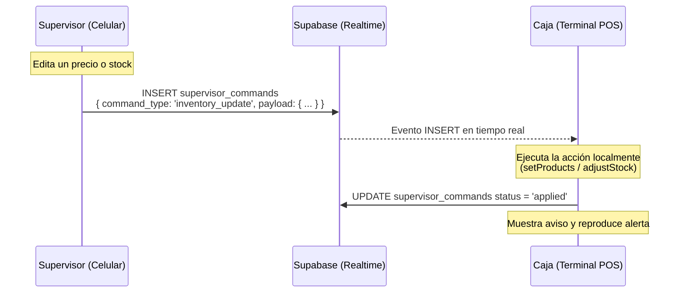

# Planes Futuros: Edición Remota de Inventario (Enfoque 1)

Este documento detalla el plan técnico definitivo para permitir al supervisor agregar, editar, eliminar productos y ajustar existencias de manera remota desde su teléfono móvil (Modo Supervisor) y propagar los cambios en tiempo real a la caja principal del negocio.

---

## 🔎 Infraestructura y Flujo de Comunicación

El sistema ya posee una tabla en Supabase llamada `supervisor_commands` y una suscripción en tiempo real en la caja principal (`useSupervisorCommands.js`) que escucha comandos de tipo `rate_change`. Reutilizaremos este canal directo para los comandos de inventario.



---

## 🛠️ Cambios Propuestos

### 1. Manejo del Comando en la Caja Principal
#### [MODIFY] [useSupervisorCommands.js](file:///c:/Users/luigg/Desktop/sistemas%20personalizados/donde%20juancho/sistema%20pos/projects/donde%20juancho/src/hooks/useSupervisorCommands.js)
*   Extender el listener en tiempo real para procesar el comando `command_type === 'inventory_update'`.
*   **Lógica de actualización local**:
    *   **Payload estructurado**:
        *   `action`: `'add' | 'edit' | 'delete' | 'adjust_stock'`
        *   `productId`: ID del producto afectado.
        *   `data`: Objeto completo del producto (para add/edit) o delta (para adjust_stock).
    *   **Acciones a ejecutar**:
        *   Para `'add'`: Añadir el producto al array local en IndexedDB y disparar evento de actualización.
        *   Para `'edit'`: Reemplazar el producto en el array local por el nuevo objeto.
        *   Para `'delete'`: Filtrar y remover el producto.
        *   Para `'adjust_stock'`: Invocar el método `adjustStock(productId, delta)` local.
    *   **Actualizar Estado y Audit Log**:
        *   Disparar evento `app_storage_update` con la key `bodega_products_v1`.
        *   Registrar el movimiento en el historial de auditoría de la caja.
        *   Disparar evento visual para alerta/notificación en la terminal (ej: *"Inventario actualizado por Supervisor"*).

---

### 2. Panel de Edición en el Monitor del Supervisor
#### [MODIFY] [OwnerMonitorView.jsx](file:///c:/Users/luigg/Desktop/sistemas%20personalizados/donde%20juancho/sistema%20pos/projects/donde%20juancho/src/views/OwnerMonitorView.jsx)
*   **Habilitar Modo Edición**:
    *   Dado que el supervisor visualiza la pestaña "Inventario" de forma pasiva, agregaremos botones para:
        *   **Ajuste rápido de stock**: Mostrar botones `+` y `-` en las tarjetas.
        *   **Editar**: Abrir un formulario flotante con los campos de precio y costo.
        *   **Nuevo**: Botón de agregar producto.
*   **Emisión de Comandos**:
    *   Al guardar los cambios en la UI del supervisor, en lugar de modificar el IndexedDB local del celular directamente, se hace un insert en `supervisor_commands` apuntando al `primary_device_id` vinculado.
    *   Ejemplo de código:
        ```javascript
        const handleRemoteStockAdjust = async (productId, delta) => {
            await supabaseCloud
                .from('supervisor_commands')
                .insert({
                    primary_device_id: pairedDeviceId,
                    monitor_device_id: myDeviceId,
                    command_type: 'inventory_update',
                    payload: {
                        action: 'adjust_stock',
                        productId,
                        data: { delta }
                    },
                    status: 'pending'
                });
            showToast('Ajuste de stock enviado a la caja', 'success');
        };
        ```

---

### 3. Notificación Visual en la Caja
#### [NEW] [SupervisorInventoryNotification.jsx](file:///c:/Users/luigg/Desktop/sistemas%20personalizados/donde%20juancho/sistema%20pos/projects/donde%20juancho/src/components/SupervisorInventoryNotification.jsx)
*   Un componente flotante tipo banner similar a `SupervisorRateNotification.jsx` que reproduzca un sonido suave e informe al cajero en pantalla: *"El supervisor ha modificado un precio/stock"* con opción de cerrar inmediatamente.

---

## 🧪 Plan de Verificación

### Pruebas de Flujo
1.  **Edición Remota en Vivo**:
    *   Conectar celular (Supervisor) and PC (Caja).
    *   Editar un precio en el celular y presionar guardar.
    *   Verificar que la caja reciba el comando, actualice el precio en pantalla sin parpadeos, y guarde el cambio localmente en IndexedDB.
2.  **Sincronización de Stock**:
    *   Realizar un ajuste rápido en el celular del supervisor.
    *   Confirmar que el stock cambie de inmediato en la terminal del cajero.
3.  **Tolerancia a Fallos Offline**:
    *   Desconectar la PC de internet temporalmente.
    *   Realizar un cambio desde el celular del supervisor. El comando quedará `pending` en Supabase.
    *   Reconectar la PC y verificar que al reconectar el canal procese las tareas pendientes y actualice el inventario de forma retroactiva.
